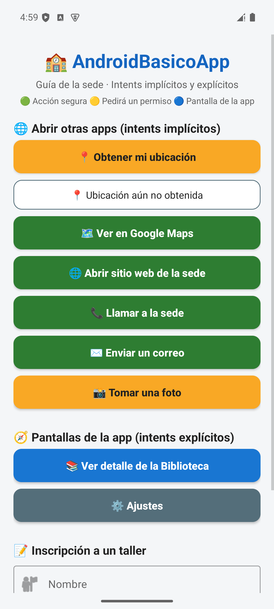
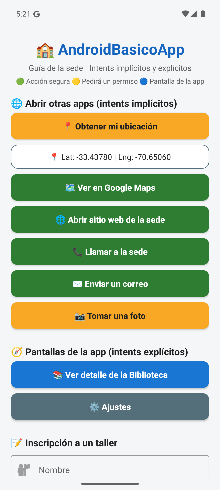
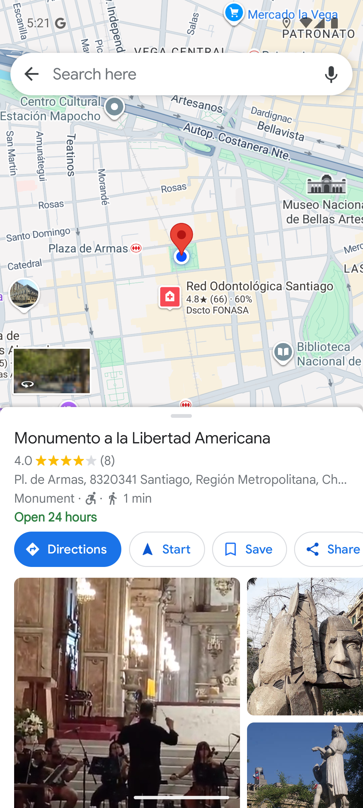
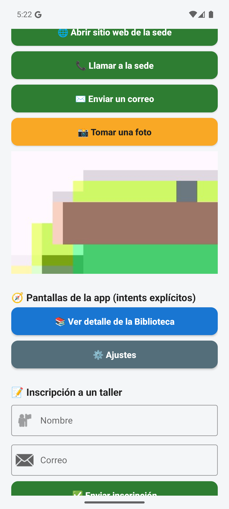
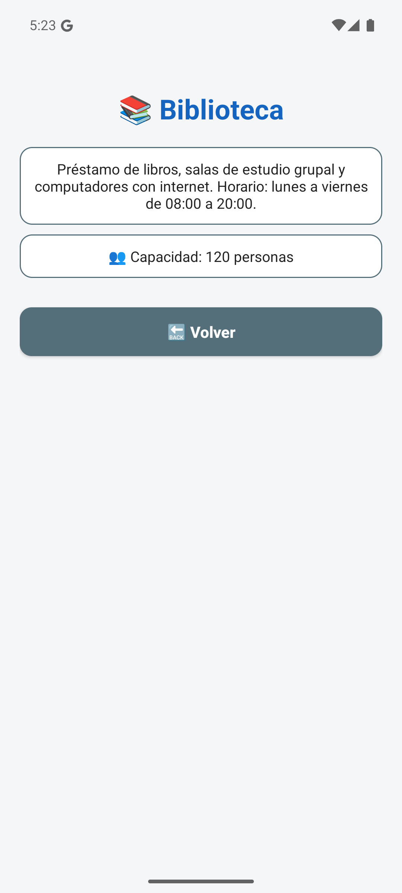
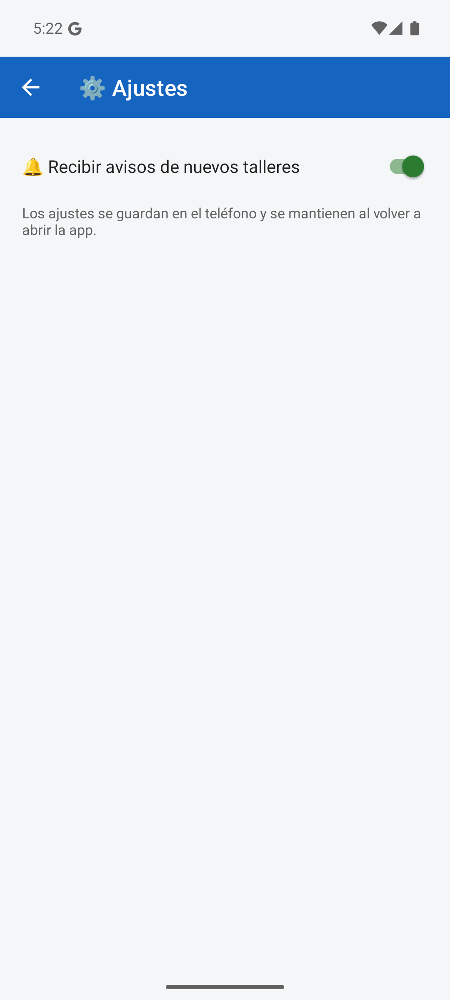
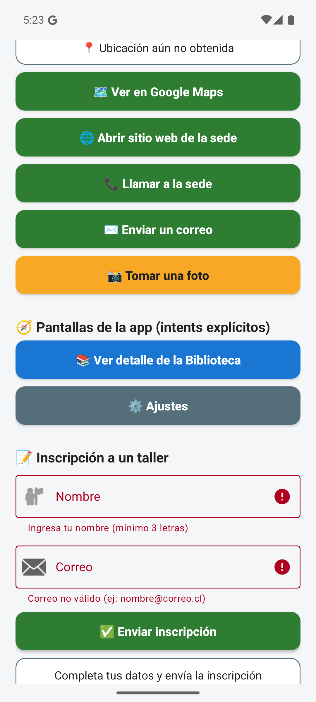
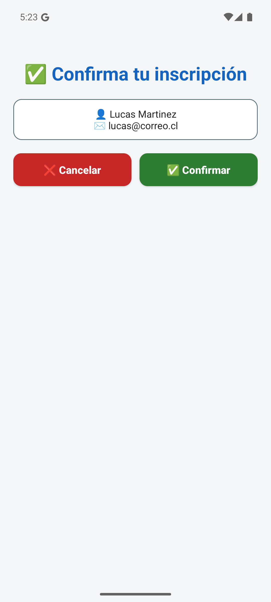
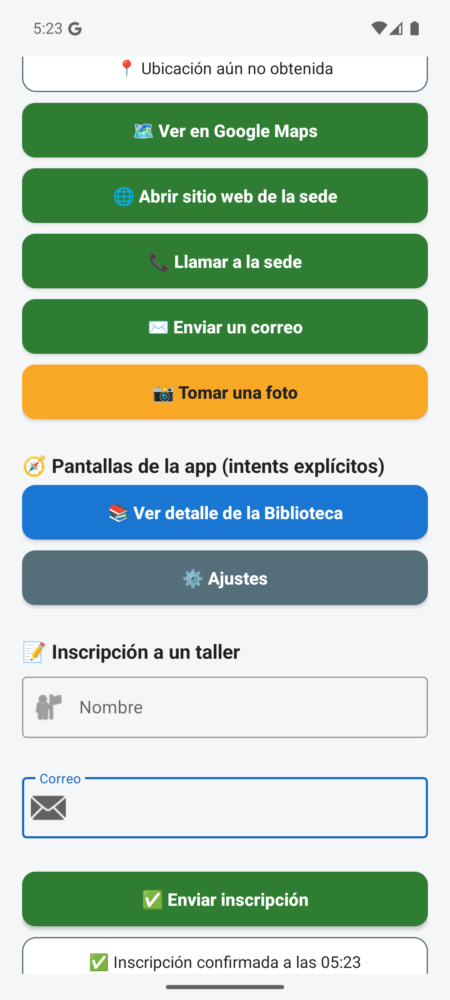

# 🏫 AndroidBasicoApp — Prototipo 2 (Programación Android)

📱 **AndroidBasicoApp** es una guía de la sede: permite ver la sede en el mapa, abrir el sitio web, llamar, escribir un correo,
tomar fotos y navegar a pantallas propias (detalle, ajustes e inscripción a un taller).

🎯 **Objetivo del prototipo:** ampliar la interacción de la app con **5 intents implícitos** (abren otras apps o el
hardware del teléfono) y **3 intents explícitos** (navegan entre pantallas de la propia app), con validaciones en
todas las funcionalidades.

👥 **Equipo:** Lucas Martínez · Matías San Martín

---

## 🛠️ Versiones

| Herramienta | Versión |
|---|---|
| 🤖 Android (compileSdk / targetSdk) | 36 — Android 16 |
| 📉 minSdk | 29 — Android 10 |
| 🔌 Android Gradle Plugin (AGP) | 9.0.1 |
| 🐘 Gradle | 9.2.1 |
| ☕ Lenguaje | Java 11 |
| 🧰 Android Studio | Panda 1 (2025.3.1) |

---

## 🌐 Intents implícitos (5)

| # | Intent | Acción | ✅ Validaciones |
|---|---|---|---|
| I1 | 🗺️ Ver ubicación en Google Maps | `ACTION_VIEW` + `geo:lat,lng?q=...` | Permiso de ubicación, GPS apagado, ubicación nula → muestra la sede |
| I2 | 🌐 Abrir sitio web | `ACTION_VIEW` + `https://` | `try/catch` si no hay navegador |
| I3 | 📞 Llamar a la sede | `ACTION_DIAL` + `tel:` | No requiere permiso `CALL_PHONE`; `try/catch` |
| I4 | ✉️ Enviar correo | `ACTION_SENDTO` + `mailto:` (destinatario, asunto y cuerpo prellenados) | `try/catch` si no hay app de correo |
| I5 | 📸 Tomar foto y guardarla en la galería | `MediaStore.ACTION_IMAGE_CAPTURE` + `EXTRA_OUTPUT` | Permiso de cámara, URI nula, resultado OK/cancelado (borra la foto vacía) |

📍 **Sensor de ubicación:** el botón *Obtener mi ubicación* usa `LocationManager` para leer latitud y longitud, que luego usa I1.

## 🧭 Intents explícitos (3)

| # | Origen → Destino | Qué demuestra | ✅ Validaciones |
|---|---|---|---|
| E1 | `MainActivity` → `DetalleActivity` | Envía datos con `putExtra` y los carga en un **Thread** | Extras nulos → texto por defecto; `int` con valor por defecto |
| E2 | `MainActivity` → `ConfigActivity` | **Toolbar** con flecha *Atrás* y ajuste guardado en `SharedPreferences` | `getSupportActionBar()` nulo |
| E3 | `MainActivity` (formulario) → `ConfirmActivity` → vuelve | `registerForActivityResult` con `RESULT_OK` / `RESULT_CANCELED` | Campos vacíos, formato de correo, respuesta sin datos |

## 🧵 Threads

- 📸 **Vista previa de la foto:** la miniatura se genera en un `Thread` y se muestra con `runOnUiThread` (la pantalla no se congela).
- 📚 **Detalle:** simula una consulta lenta en un `Thread` y luego muestra los datos en el hilo principal.

## 🎨 Diseño

Los colores de los botones le indican al usuario qué esperar:
🟢 acción segura · 🟡 pedirá un permiso · 🔵 abre una pantalla de la app · 🔴 cancela.
Todos los textos, colores y medidas están en `strings.xml`, `colors.xml` y `dimens.xml`.

---

## 🧪 Pasos de prueba

| # | Pasos | Resultado esperado |
|---|---|---|
| I1 | Tocar **📍 Obtener mi ubicación** → *Permitir* → tocar **🗺️ Ver en Google Maps** | Se ven latitud y longitud; Maps abre en esa ubicación. Sin permiso: Maps muestra la sede |
| I2 | Tocar **🌐 Abrir sitio web de la sede** | El navegador abre www.santotomas.cl |
| I3 | Tocar **📞 Llamar a la sede** | El marcador aparece con el número escrito, sin llamar |
| I4 | Tocar **✉️ Enviar un correo** | La app de correo abre con destinatario, asunto y mensaje |
| I5 | Tocar **📸 Tomar una foto** → *Permitir* → sacar la foto → ✔ | Aparece la vista previa y la foto queda en *Galería › AndroidBasicoApp*. Si se cancela, no queda una foto vacía |
| E1 | Tocar **📚 Ver detalle de la Biblioteca** | Se ve "Cargando…" 1,5 s y luego los datos enviados |
| E2 | Tocar **⚙️ Ajustes** → cambiar el interruptor → **←** | Vuelve al menú; al entrar de nuevo, el ajuste se mantiene |
| E3 | Enviar el formulario vacío | Errores en rojo bajo cada campo; no cambia de pantalla |
| E3 | Datos válidos → **✅ Enviar** → **✅ Confirmar** | Vuelve con "✅ Inscripción confirmada a las HH:mm" |
| E3 | Datos válidos → **✅ Enviar** → **❌ Cancelar** (o Atrás) | Vuelve con "❌ Inscripción cancelada" y los datos siguen escritos |

---

## 📸 Capturas

Probado en emulador **Pixel 7 · Android 15 (API 35)**.

| 🏠 Menú principal | 📍 Ubicación obtenida | 🗺️ I1: Google Maps |
|:---:|:---:|:---:|
|  |  |  |

| 📸 I5: Foto y vista previa | 📚 E1: Detalle | ⚙️ E2: Ajustes |
|:---:|:---:|:---:|
|  |  |  |

| ⚠️ Validaciones del formulario | ✅ E3: Confirmación | 🔁 Resultado devuelto |
|:---:|:---:|:---:|
|  |  |  |

---

## 📦 APK

⬇️ [`apk/AndroidBasicoApp-v1.0.apk`](apk/AndroidBasicoApp-v1.0.apk) — instalar en un teléfono con Android 10 o superior
(permitir *instalar apps de origen desconocido*).

## ▶️ Cómo compilar

1. Clonar el repositorio y abrirlo en **Android Studio** (*File → Open*).
2. Esperar la sincronización de Gradle.
3. Ejecutar ▶️ en un emulador o teléfono, o generar el APK con *Build → Generate App Bundles or APKs → Generate APKs*.

## 🗂️ Estructura

```
app/src/main/
├── AndroidManifest.xml            🔐 permisos y Activities
├── java/com/prototipo2/androidbasicoapp/
│   ├── MainActivity.java          🏠 menú, 5 implícitos y formulario
│   ├── DetalleActivity.java       📚 E1 (extras + Thread)
│   ├── ConfigActivity.java        ⚙️ E2 (Toolbar + SharedPreferences)
│   └── ConfirmActivity.java       ✅ E3 (devuelve resultado)
└── res/
    ├── layout/                    🖼️ una pantalla por Activity
    └── values/                    🎨 strings, colors, dimens y themes
```
